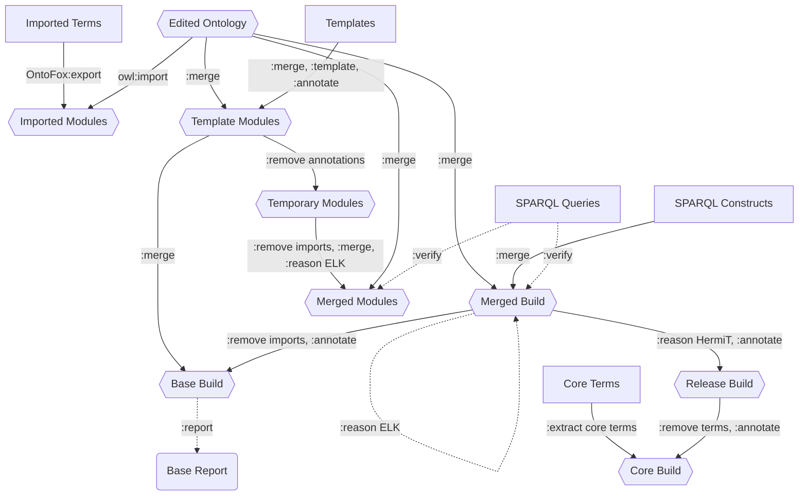

# Advanced Pipeline Architecture
### Purpose
* This is a model of the pipeline used in OBI's Makefile by James Overton: https://github.com/obi-ontology/obi/blob/master/Makefile
* This pipeline runs automated tests, builds reports, creates modules from templates, and builds base, release, and core versions of the ontology.
* Differences with the basic ontology pipeline:
	* "Templates" are used for quickly adding many terms at once
		* "Template Modules" are then generated and merged together with the "Edited Ontology", then tested
	* A "Base Build" removes imports and only a "Base Report" is created
	* A "Core Build" contains a selected subset of "Core Terms"
	* "SPARQL Constructs" are inserted terms

### Classification
* "Edited Ontology" is a http://purl.obolibrary.org/obo/IAO_8000002 "editors ontology module"
* "Release Build" is a http://purl.obolibrary.org/obo/IAO_8000003 "main release ontology module"
* "Base Build" is a http://purl.obolibrary.org/obo/IAO_8000001 "base ontology module"
* "Core Build" is a http://purl.obolibrary.org/obo/IAO_8000014 "generated ontology module"
* "Imported Modules" are instances of http://purl.obolibrary.org/obo/IAO_8000005 "import ontology module"
* "Template/Temporary/Merged Modules" are instances of http://purl.obolibrary.org/obo/IAO_8000015 "template generated ontology module"

### Diagram Key
* Hexagons are ontologies
* Rectangles are SPARQL or text files
* Rounded boxes are spreadsheets
* Dotted lines involve automated tests
* ":" prefix means ROBOT command

