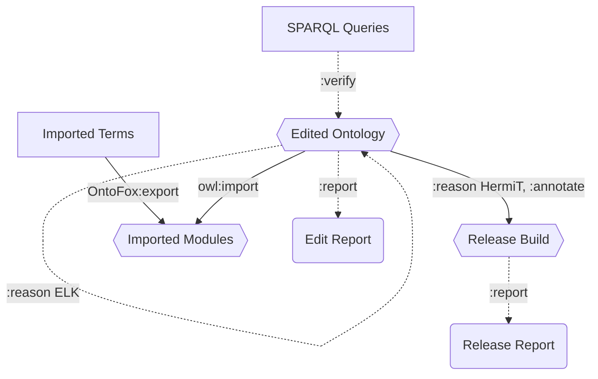

# Architecture of Basic Ontology Pipeline
### Purpose
* This pipeline runs automated tests, builds reports, and builds a release version of the ontology.

### Classification
* "Edited Ontology" is a http://purl.obolibrary.org/obo/IAO_8000002 "editors ontology module"
* "Release Build" is a http://purl.obolibrary.org/obo/IAO_8000003 "main release ontology module"
* "Imported Modules" are instances of http://purl.obolibrary.org/obo/IAO_8000005 "import ontology module"

### Diagram Key
* Hexagons are ontologies
* Rectangles are SPARQL or text files
* Rounded boxes are spreadsheets
* Dotted lines involve automated tests
* ":" prefix means ROBOT command

	
