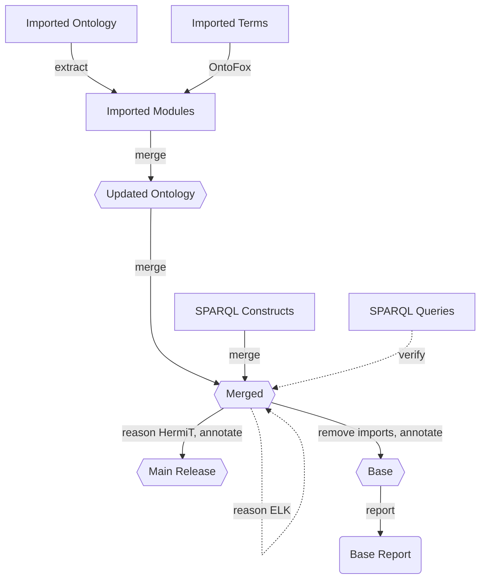

# Intermediate Pipeline
* Import, Test, Release, Report
* Key
	* Rectangles are plural entities
	* Hexagons are singular ontologies
	* Bubbles are reports
	* NOTE: links rendered in Github must be opened in another tab/window
	
